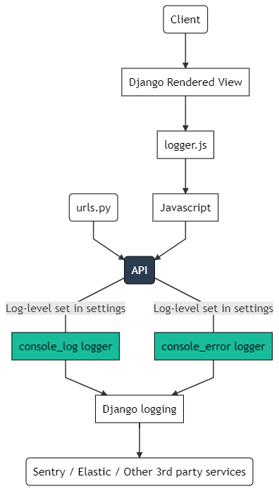

========================
Django Javascript Logger
========================

.. image:: https://img.shields.io/pypi/v/django-js-logger.svg
    :target: https://pypi.org/project/django-js-logger/

.. image:: https://img.shields.io/pypi/pyversions/django-js-logger.svg
    :target: https://pypi.org/project/django-js-logger/

.. image:: https://img.shields.io/pypi/djversions/django-js-logger.svg
    :target: https://pypi.python.org/pypi/django-js-logger

.. image:: https://codecov.io/gh/sondrelg/django-js-logger/branch/master/graph/badge.svg
    :target: https://codecov.io/gh/sondrelg/django-js-logger/

.. image:: https://img.shields.io/badge/code%20style-black-000000.svg
    :target: https://pypi.org/project/django-swagger-tester/

.. image:: https://img.shields.io/badge/pre--commit-enabled-brightgreen?logo=pre-commit&logoColor=white
    :target: https://github.com/pre-commit/pre-commit

|

Simple Django app for logging Javascript's ``console.log`` logs to Django.

Useful for catching Javascript errors that are not logged by Django natively and would otherwise only be logged to the client's console.

The app works by posting all logs to an internal API; because of this, it should likely not be run in performance-sensitive production environments.

If you want to implement this package, and require extra functionality please feel free to commit an issue or a PR. Otherwise, this currently does exactly what I need it to do, and I likely won't change it.

Quick start
-----------

1. Add "js_logger" to your INSTALLED_APPS settings::

    INSTALLED_APPS = [
        ...
        'js_logger',
    ]

2. Include the packages URLconf in your project urls.py like this::

    path('js-logs/', include('js_logger.urls')),

3. Add the required static file to your project by running ``manage.py collectstatic``, or by manually adding the following code to ``<your-templates-folder>/js-logging/js-logging.html``::

    

4. Include the template where ever you wish for logs to be sent in from (perhaps a base or header template)::

    <head>
    ...
    
    ...
    </head>

5. Add ``console.log`` as a logger in your logging configuration::

    'console.log': {
        'level': 'INFO',
        ...
    },

Note: This package will log all `console.log` calls in your frontend as ``INFO`` logs, and will log javascript errors as ``ERROR`` logs.
